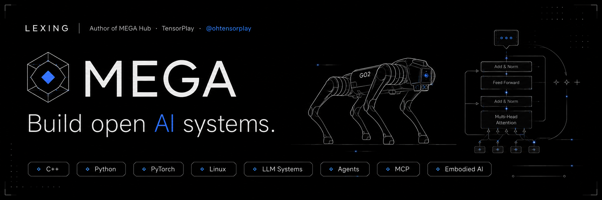

  

  

<a href="https://status.tensorplay.cn">
  <picture>
    <source
      media="(prefers-color-scheme: dark)"
      srcset="https://raw.githubusercontent.com/lexing-2026/lexing-2026/gh-pages/status-history-dark.svg"
    />
    
  </picture>
</a>

 

<a href="https://status.tensorplay.cn">status.tensorplay.cn ↗</a>

  

  

  

<picture>
  <source
    media="(prefers-color-scheme: dark)"
    srcset="https://raw.githubusercontent.com/lexing-2026/lexing-2026/gh-pages/github-snake-dark.svg"
  />
  <source
    media="(prefers-color-scheme: light)"
    srcset="https://raw.githubusercontent.com/lexing-2026/lexing-2026/gh-pages/github-snake.svg"
  />
  
</picture>

  

